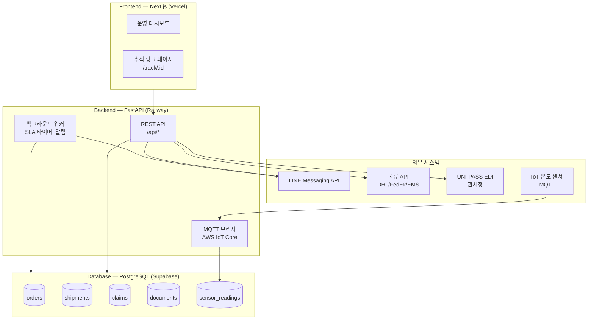

# 시스템 개요 — GEUMTAE Export

## 1. 도메인 구조

GEUMTAE Export 시스템은 6개 핵심 도메인으로 구성된다.

```
[수주관리]  →  [출하관리]  →  [콜드체인/물류]  →  [통관/서류]
                                                        ↓
                                            [고객(바이어) 관리]
                                                        ↓
                                               [모니터링/리포팅]
```

---

## 2. 시스템 컴포넌트 다이어그램



---

## 3. 데이터 흐름

### 정상 흐름 (Happy Path)

```
1. 바이어 발주 → POST /api/orders/
2. PO 발주 확정 → PUT /api/orders/{id}/confirm
   → SLA 타이머 기산 (promisedDeliveryDate + 1day)
   → 납품 DocumentSet 자동 생성
3. 출하 등록 → POST /api/shipments/
   → 캐리어 API 연동 → 추적 링크 생성
   → LINE으로 바이어에게 추적 링크 자동 발송 (30분 이내)
4. 운송 중
   → IoT 센서 → MQTT → AWS IoT Core → FastAPI 워커
   → 3회 연속 temp > 5°C → TemperatureAlert → 담당자 LINE 알림
5. 도착 확인 → PUT /api/shipments/{id} (actualDeliveryAt 기록)
   → SLA 자동 판정: 기준 초과 시 SlaViolation 생성
6. 서류 완료 → EDI 자동 전송 (UNI-PASS)
```

### 클레임 흐름

```
바이어 선도 불량 신고 → POST /api/claims/
→ 상태: RECEIVED → REVIEWING (48시간 타이머 기산)
→ 처리 완료 → RESOLVED → 바이어 LINE 알림
→ 48시간 초과 → PO 에스컬레이션 알림
```

---

## 4. 기술 스택

| 레이어 | 선택 | 버전 | 역할 |
|---|---|---|---|
| Frontend | Next.js | 14+ | 운영 대시보드 + 공개 추적 페이지 |
| Backend | FastAPI + Python | 0.111+ / 3.11 | REST API + 백그라운드 워커 |
| DB | PostgreSQL | 15 (Supabase) | 발주/납품/클레임/서류 저장 |
| ORM | supabase-py | 2.x | Supabase 클라이언트 |
| IoT | AWS IoT Core | - | MQTT 브로커 + 센서 데이터 수집 |
| 배포 Backend | Railway | - | `$PORT` 환경변수 기반 uvicorn |
| 배포 Frontend | Vercel | - | Next.js 자동 배포 |
| 메시징 | LINE Messaging API | - | 바이어 CS + 자동 알림 |
| 물류 추적 | DHL/FedEx/EMS API | - | 국제 추적 URL 생성 |
| 통관 EDI | UNI-PASS (관세청) | - | 수출 신고 자동화 |

---

## 5. 도메인별 핵심 Aggregate

### 도메인 1: 수주관리 (Order Management)

| Entity | 핵심 속성 | 상태 전이 |
|---|---|---|
| Order (Root) | orderId, buyerId, promisedDeliveryDate, status | DRAFT → CONFIRMED → IN_TRANSIT → DELIVERED → CLOSED |
| OrderItem | productCode, weightKg, unitPrice | - |
| SlaViolation | orderId, delayDays, compensationAmount | - |

### 도메인 2: 출하관리 (Shipment Management)

| Entity | 핵심 속성 | 상태 전이 |
|---|---|---|
| Shipment (Root) | shipmentId, orderId, departureDate, carrier, trackingNumber | PREPARING → DEPARTED → IN_TRANSIT → CUSTOMS_CLEARED → DELIVERED |
| QualityReport | shipmentId, weightKg, freshnessGrade, haccpLotNumber | - |

### 도메인 3: 콜드체인/물류

| Entity | 핵심 속성 |
|---|---|
| SensorReading | shipmentId, temp, ts, hash (무결성) |
| TemperatureAlert | alertId, shipmentId, temp, alertedAt |
| TrackingLink | shipmentId, carrier, trackingUrl, sentAt |

### 도메인 4: 통관/서류

| Entity | 핵심 속성 |
|---|---|
| DocumentSet (Root) | shipmentId, checklist, status |
| Document | documentType (HACCP_CERT / HEALTH_CERT / ORIGIN_CERT / EXPORT_DECLARATION) |
| ExportDeclaration | ediStatus, declarationNumber |

### 도메인 5: 고객(바이어) 관리

| Entity | 핵심 속성 |
|---|---|
| Claim (Root) | claimId, shipmentId, status (FSM), deadline |
| MessageThread | buyerId, lastRepliedAt, slaTimer |
| SampleRequest | buyerId, shipmentId, feedbackDueDate |

### 도메인 6: 모니터링/리포팅

| Entity | 핵심 속성 |
|---|---|
| MonthlyReport | period, totalShipments, slaRate, returnRate |
| BuyerSummary | buyerId, orderCount, totalKg, reorderRate |

---

## 6. 외부 의존성 및 폴백

| 외부 시스템 | 가용성 이슈 시 폴백 |
|---|---|
| DHL/FedEx/EMS API | 캐리어 공식 추적 사이트 URL 수동 제공 |
| LINE Messaging API | SMS 폴백 발송 |
| UNI-PASS EDI | 수동 서류 제출 + 오류 로그 보관 |
| AWS IoT Core | 15분 신호 없음 → 담당자 수동 확인 알림 |
| Supabase DB | Railway 내 PostgreSQL 컨테이너 백업 |

---

## 관련 문서

- [[SRS]]
- [[api_contracts]]
